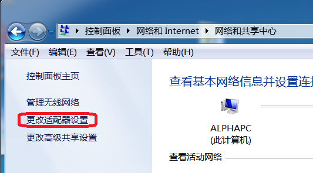
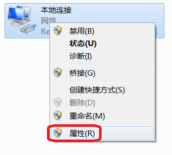
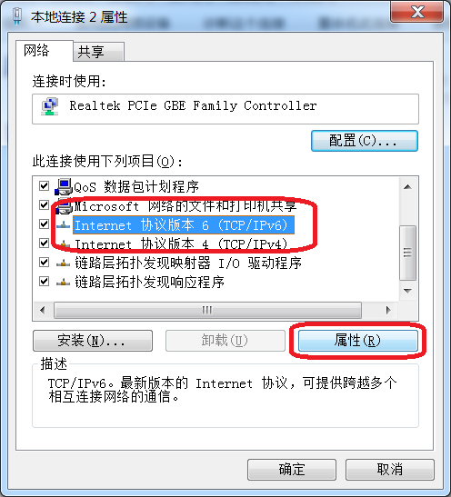
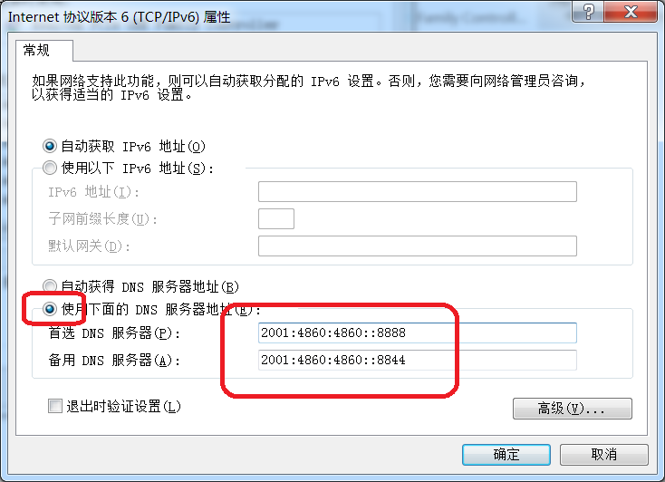

[返回首页](../README.md)  

# IPv6科研指南  

一言以蔽之，访问谷歌用方法一、看YouTube用方法一 + 方法二  

------  
## 方法一：更改IPv6的DNS  

**这两个DNS就是你的目标**  
```
2001:4860:4860::8888
2001:4860:4860::8844
```  

###### （1）Windows系统操作步骤  

Step 1. 依次打开控制面板 -> 网络和Internet -> 网络和共享中心 ，点击左侧“更改适配器设置”  

  

Step 2. 选中你的本地连接，右击，在右键菜单中点击“属性”  

  

Step 3. 选中“Internet 协议版本 6 (TCP/IPv6)”，点击属性  

  

Step 4. 选中“使用下面的DNS服务器地址”，填入如图所示的DNS地址  

  

Step 5. 关闭所有浏览器，打开CMD，输入如下命令(当然，你要高兴重启的话也是可以的)：  
```
ipconfig /flushdns
```  

Step Done. 好了，重新打开浏览器，输入https://www.google.com/ ，你应该能happy的科研了。（注意开头一定要加上“https://” ，不要漏掉“s"）  


###### （2）Ubuntu系统  

大神你别逗我，你肯定会  


------  
## 方法二：替换hosts文件  

1. [hosts文件下载](../res/hosts)  
2. [参考链接](https://serve.netsh.org/pub/ipv6-hosts/)  
替换方法请自行百度  


------  
## 方法三：蓝灯/lantern（不需要有IPv6）  

一个蛮好用的翻墙软件  
###### 官网  
[https://getlantern.org/](https://getlantern.org/)  


------  
## 方法四：Tor Browser  

这个还真的不推荐，非常难弄，而且非常慢  


## 附  
当然，请确保你有IPv6连接。做完上面这些工作，你应该能自由使用Google学术、Gmail了。如果出现连接被重置，请确保你输入的网址最开头是https，一定要有那个“s”。  
还有一些内容没写完，心情好再写~  
