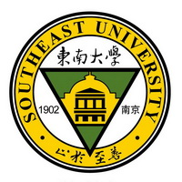

 

## 置顶的重要内容  
1. [**IPv6科研指南**](IPv6/IPv6.md)  
    - 欢快的使用Google学术、Gmail、甚至Youtube  
2. [清华大学开源软件镜像站](https://mirrors.tuna.tsinghua.edu.cn/)  
    - 各种Linux发行版(Ubuntu、Centos、Fedora、Debian)以及一些应用软件（VirtualBox，TexLive），通过IPv6访问免流量（https://mirrors6.tuna.tsinghua.edu.cn/）  

## 校内链接  
1. [虎踞龙蟠BBS](http://bbs.seu.edu.cn/)  
    - 除了BBS，还有愉快的 **虎踞龙蟠PT站** ，非常推荐  
3. [个人信息门户](http://my.seu.edu.cn/)  
4. [VPN服务](https://vpn2.seu.edu.cn/)  
    - 在校外下载文献必用  
4. [Web认证](https://w.seu.edu.cn/)  
    - 登录页面  
5. [网络认证自助服务](https://selfservice.seu.edu.cn/selfservice/index.php)  
    - 交网费的地方  
6. [网络与信息中心](http://nic.seu.edu.cn/)  
    - 页面右侧有个正版化平台，上面可以下 **正版的** Windows，Office，MATLAB，还有Autodesk  
7. [财务处](http://caiwuchujf.seu.edu.cn/WFManager/login.jsp)（查询补助等等）  
    - 建议中行卡的同学微信关注“中国银行微银行”，绑定借记卡后可以获得免费的资金变动提醒  

## 实用贴  
1. [**IPv6科研指南**](IPv6/IPv6.md)  
    - 欢快的使用Google学术、Gmail、甚至Youtube  
2. [校内NAS](./posts/东南NAS.md)  
    - 电影、电视剧的资源服务器  
    - **最近好像用不了，不知道什么原因**  
3. [ftp://ftp.nlabct.net/](ftp://ftp.nlabct.net/)  
    - Vivado、MATLAB、Ubuntu、CentOS、Fedora、OpenSUSE、VirtualBox、JDK……等各种软件  
4. [清华大学开源软件镜像站](https://mirrors.tuna.tsinghua.edu.cn/)  
    - 各种Linux发行版以及一些应用软件（VirtualBox，TexLive），通过IPv6访问免流量（https://mirrors6.tuna.tsinghua.edu.cn/）  

## 班车信息  

### 1. 无线谷班车
  

### 2. [九龙湖小区接驳车](http://zwc.seu.edu.cn/2015/0428/c4297a122944/page.htm)  
  
